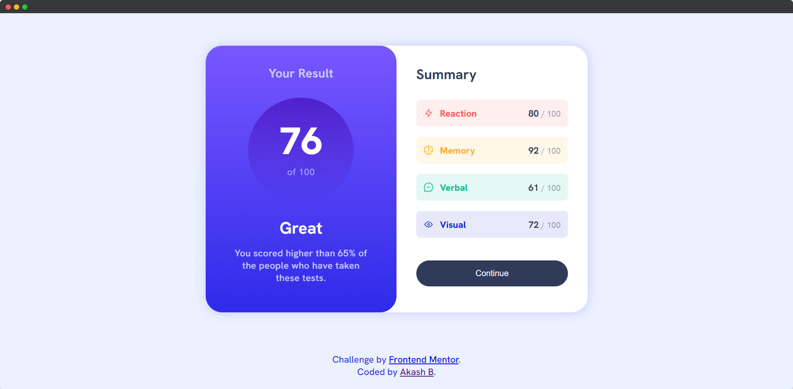
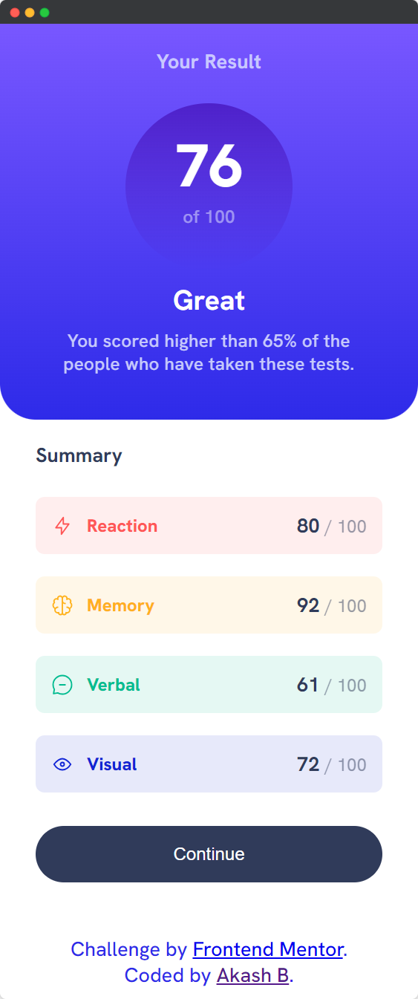

# Results summary component

This is a solution to the [Results summary component challenge on Frontend Mentor](https://www.frontendmentor.io/challenges/results-summary-component-CE_K6s0maV).

## Table of contents

- [Results summary component](#results-summary-component)
  - [Table of contents](#table-of-contents)
    - [The challenge](#the-challenge)
    - [Screenshot](#screenshot)
    - [Links](#links)
    - [Built with](#built-with)
  - [Author](#author)

### The challenge

Users should be able to:

- View the optimal layout for the interface depending on their device's screen size
- See hover and focus states for all interactive elements on the page
- **Bonus**: Use the local JSON data to dynamically populate the content

### Screenshot

**Desktop**

**Mobile**

### Links

- Solution URL: [Add solution URL here](https://your-solution-url.com)
- Live Site URL: [Add live site URL here](https://your-live-site-url.com)

### Built with

- Semantic HTML5 markup
- CSS custom properties
- Flexbox
- 
## Author

- Website - [Akash B.](https://akashbanchhor.netlify.app)
- Frontend Mentor - [@akash02ab](https://www.frontendmentor.io/profile/akash02ab)